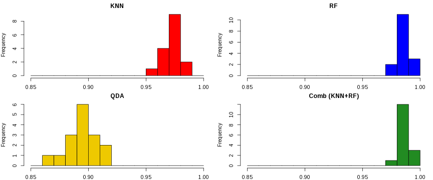

# Machine Learning (Course Project)
**Data Science -> Practical Machine Learning -> Peer Assessment**  
<br><br>  


-------------------
### Executive Summary  

This works tries to solve a classification problem and determine if a given physical activity is being preformed according to the specification or if errors exist.  
We will fit 4 different models, 3 of them will be single models and the 4th will combine the best two of the initial 3 to try to get the strengths of both. After explaining each of the models and give details on how they were fitted, we will use the final model to predict the 20 submission cases for this assignment.    
<br>

-------------------
### The problem

The main purpose of this work is trying to answer the question about the possibility to use data collected by sensors included in user wearable devices to assess whether or not the user is preforming a given physical activity in a correct way or, on the other hand, if the user is preforming it wrongly (with potential negative health impacts, such as lesions).  
As original authors said (Velloso et al, 2013), this is not the traditional activity recognition work which tries to identify **which** activity the user is preforming, but a more complex analysis trying to identify **how** a given activity is being preformed.  
<br>

-------------------
### The Data: Loading, Preprocessing and Exploratory Analysis   

We will use the data provided by _Qualitative Activity recognition of Weight Lifting Exercices_ team (Velloso et al, 2013), which includes the data collected by sensors worn by 6 different users while preforming weight lifting exercises in a controlled environment, either preforming the activity correctly or making one of four common mistakes. Data is then labeled accordingly as **A** (no execution errors) or **B** to **E** (for each of the execution errors being tested).
As a first step we will start by downloading the training and submission cases from the given assignment URLs. Once we make sure we have the right files by comparing their MD5 hash with a pre-computed one, they are loaded into memory.


```
## Training data: 19622 160 
## Testing data: 20 160
```

There are two files with 160 variables and 19622 records for the training dataset and 20 records for the test cases to be submitted. We'll keep the test cases apart until the prediction phase, later in this document. 
After some data cleanup to remove columns mostly with empty or NA records, we end up with only 60 variables with the previous number of records. Each record belongs to one (and only one) `Classe` named from A to E, with the distribution below.

```
##    A    B    C    D    E 
## 5580 3797 3422 3216 3607
```

The next step is split the training dataset into 3 different sets: one for model training, another for model testing and a last one for model validation. About 40% of the samples will be used for training, and 30% for each of testing and validation sets.  
While this might look sub optimal and not complaint with recommended 60-40 distribution for training and testing, we will use the testing set to fit our third model, so we chose to have more cases there.


```
## Training set: 7850 60 
## Testing set: 5887 60 
## Validation set: 5885 60
```

Looking into the variables' names present at the training set it is clear that some of them (X, user.name, raw.timestamp.part.1, ...) are not related to the data collected by the devices and only provide information about the record itself, such as exercise execution time or user name. Excluding those variables (first 7 columns) and the variable we want to predict (last column), leaves us with 52 potential predictor variables. 

We can also wonder if all those are really necessary. Using Principal Component Analysis to extract the main features from the dataset suggests that we can capture about 95% of data variability using 26 components (half the initial number of variables).


```
## 
## Call:
## preProcess.default(x = trainSet[, 8:59], method = "pca")
## 
## Created from 7850 samples and 52 variables
## Pre-processing: principal component signal extraction, scaled, centered 
## 
## PCA needed 26 components to capture 95 percent of the variance
```

In spite of this potential noise reduction and model simplification, during the exploratory analysis we noticed an important decrease in models' accuracy when using PCA so we will not preform this transformation to the data before fitting the models and we will therefore keep the 52 variables.  
<br>

-------------------
### Model Selection

Given the nature of the problem being addressed: correctly classifying the record within one of five different classes, some models not suited for classification (eg, linear regression) were automatically excluded on our selection process.  
Most authors agree it doesn't exist a "best model" for all problems and situations, so we cannot be sure about the best _a priori_ model to use for this problem. We then choose to use three different models to see which one is the best for this task: the **K-Nearest Neighborhood (KNN)** used to classify each observation accordingly to the know classifications of the _k_ nearest observations in the features space, the powerful (yet black-box-styled) **Random Forest (RF)** getting its strength from the ensembling techniques applied to the individual decision trees, and, the **Quadratic Discriminant Analysis (QDA)**, a method similar to linear discriminant analysis which tries to find a combination of features able to identify each class, but where each class space is delimited by a quadratic function instead of a linear function.  
At the end, the outputs of the first two models will be combined in a fourth model, trying to get the best of each of the initial models. A **Linear Discriminant Analysis (LDA)** model will be used here to put these two together. QDA model will be excluded from this phase because it has lower Accuracy and will make the combined model less accurate than the RF model alone.  
For the remaining of the document, we will use Accuracy, the probability of getting the right outcome, as the measure of model quality.  
<br>

-------------------
### Models Fitting

It is now time to start the model fitting process.  


#### Parameters
Models were mostly fitted using their default parameters, but some changes were made to try to getting better accuracy or less processing time.
Starting with KNN, we tuned the model to check more k neighbors than it will do by default to try to get more Accuracy. In this case, k=1 and k=3 were tested together with the default 5, 7 and 9. According to the results obtained, k=1 provides better Accuracy.  
As long as the RF is concerned, we reduced the number of trees from the default 500 to 64. This grants faster processing but does not penalize too much the Accuracy. According to our findings during the exploratory phase, marginal Accuracy gains quickly decrease while more trees are added. We found 64 as a good compromise between models Accuracy and processing speed. We also changed the number of variables samples evaluated at each node, checking for 2, 4, 8, 16 and 32 variables instead of the original 2, 27 and 52.  
Traversal to all models, we can find the pre-processing settings. In all cases variables were centered and scaled.  

#### Cross-Validation
All models were subject to 2 different levels of cross validation.  
The first level was computed during the fitting process itself. To accomplish this, 16 different random sub-samples were created from the training dataset, using about 75% of the actual number of records for training and 25% for validation. Then the model were fitted on each of these sub-samples and the Accuracy computed. The summary of the results are on the table below.  


```
##       Min. 1st Qu. Median  Mean 3rd Qu.  Max. NA's
## KNN  0.955   0.969  0.972 0.972   0.976 0.986    0
## RF   0.973   0.985  0.987 0.986   0.990 0.994    0
## QDA  0.868   0.884  0.896 0.896   0.904 0.919    0
## Comb 0.978   0.981  0.984 0.985   0.987 0.995    0
```

The second level of cross-validation is preformed using the fitted models to predict the known class for the 'Testing Set' (for KNN, RF and QDA models) records and for the 'Validation Set' (for the Combined model) and compare the prediction  with the actual class. The results, also measured by Accuracy, are the following: 


```
## $Accuracy
##    KNN     RF    QDA   Comb 
## 0.9774 0.9852 0.8950 0.9883
```

 

**Fig.1** - Distribution of each model Accuracy computed during the fitting process.  

We can see the Accuracy obtained on the 'Testing Set' and 'Validation Set' is very similar to the mean and median expected Accuracy computed during model fitting. It seems models are not over-fitted to the training data and can 'safely' be used to predict classes on new datasets.  

#### Details
We will now show some details for the final model. First of all we will print a matrix with comparison between the predicted class and the actual class for the 'Validation Set'. We can see most of the observations lie in the matrix diagonal, which means Prediction equals the Reference values.     


```
##           Reference
## Prediction    A    B    C    D    E
##          A 1663   14    0    0    0
##          B    7 1120   10    0    0
##          C    4    4 1013   16    0
##          D    0    1    3  947    9
##          E    0    0    0    1 1073
```

```
##                   Class: A Class: B Class: C Class: D Class: E
## Sensitivity         0.9934   0.9833   0.9873   0.9824   0.9917
## Specificity         0.9967   0.9964   0.9951   0.9974   0.9998
## Pos Pred Value      0.9917   0.9850   0.9769   0.9865   0.9991
## Neg Pred Value      0.9974   0.9960   0.9973   0.9965   0.9981
## Balanced Accuracy   0.9951   0.9899   0.9912   0.9899   0.9957
```

The table above shows some detailed statistics for each class we are trying to predict. It seems the good prediction capabilities are spread across all classes and that is also a signal of model strength.  
<br>

-------------------
### Models' Results

Once we finished with the previous steps and we have our final model we can then preform the last final step: use this final model to predict the 20 submission cases.  
The results are the following:


```
##  [1] B A B A A E D B A A B C B A E E A B B B
## Levels: A B C D E
```

After submission, it resulted in 20 right predictions out of 20 records to predict. 
Playing around with the Poisson distribution, an assuming an average 'miss ratio' of about 1.2 predictions out of every 100 attempts, we can compute a 78.6628 percent probability of the 20/20 performance achieved (ie, 0 misses in 20 attempts).  
<br>

-------------------
### Reproducibility

This report has been made using R Markdown and the presented results should be fully reproducible. The following software environment has been used: 
- OS: Linux x86_64 (3.15.9-pclos1)
- R: 3.1.1
- RStudio: 0.98.481
- R packages: 
  - knitr (1.6)
  - tools (3.1.1)
  - caret (6.0-35):
      - lattice(0.20-29)
      - ggplot2 (1.0.0)
      - kernlab (0.9-19)
      - randomForest (4.6-10)
      - MASS (7.3-33)
  - doMC (1.3.3):
      - foreach (1.4.2)
      - iterators (1.0.7)
      - parallel (3.1.1)


```
## Report generated on: 2014-09-20 17:35:10 CEST 
## Processing time: 4 minutes and 58 seconds.
```

All the code used to produce this report is available on [Github](https://github.com/bpvg/DS_MachLearn_Peer).  
<br>

-------------------
### References

Filzmoser, Peter _Linear and Nonlinear Methods for Regression and Classification and applications in R_. Vienna University of Technology, 2008  

Hastie, Trevor; Tibshirani, Robert; Friedman, Jerome _The Elements of Statistical Learning_. Springer, 2008  

Shalizi, Cosma R. _Advanced Data Analysis from an Elementary Point of View_. Carnegie Mellon University, 2013  

Velloso, E.; Bulling, A.; Gellersen, H.; Ugulino, W.; Fuks, H. _Qualitative Activity Recognition of Weight Lifting Exercises. Proceedings of 4th International Conference in Cooperation with SIGCHI (Augmented Human '13)_ . Stuttgart, Germany: ACM SIGCHI, 2013.  
